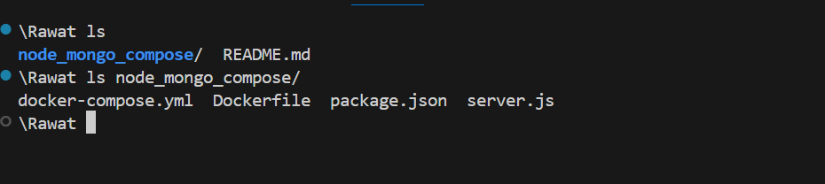
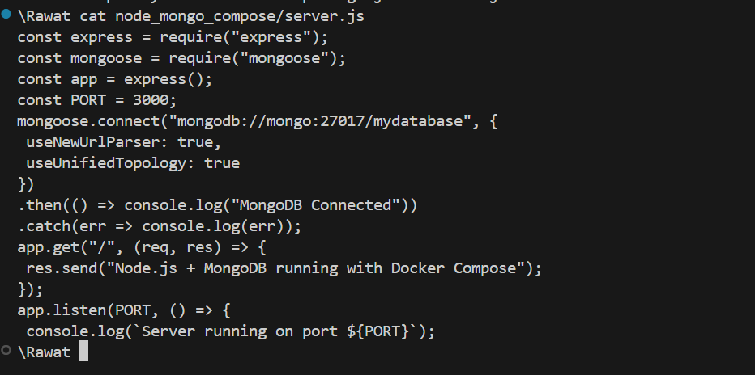
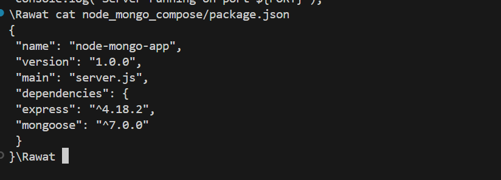
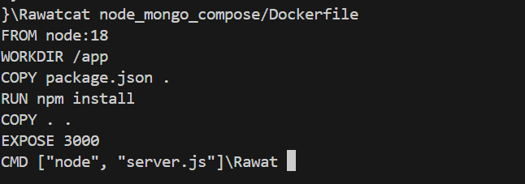
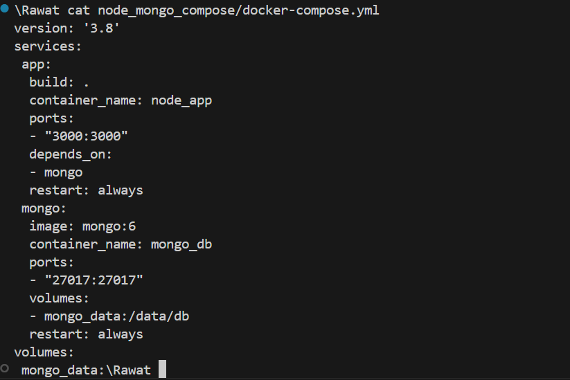
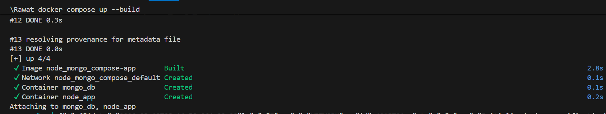
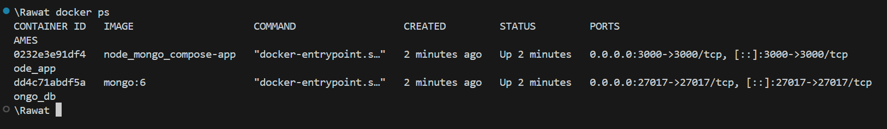
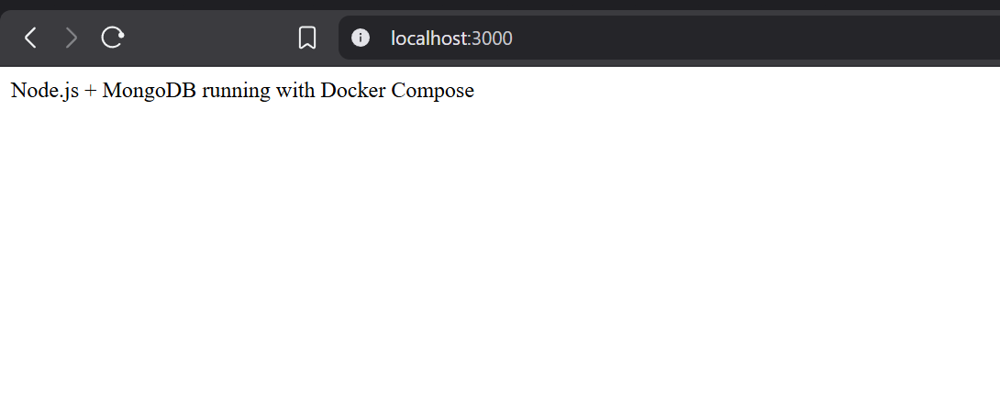

# Practical no. 4 : Deploy Node.js + MongoDB Application using Docker Compose

## Objective

- To understand multi-container applications using Docker Compose.
- To deploy a Node.js web application connected with MongoDB database.

## Project Structure

### Create the following folder structure:

```text
node-mongo-compose/
│
├── docker-compose.yml
├── package.json
├── server.js
└── Dockerfile
```

<details>
  <summary>Screenshot of the my system</summary>
  

</details>

### File name : server.js

```js
const express = require("express");
const mongoose = require("mongoose");
const app = express();
const PORT = 3000;
mongoose
  .connect("mongodb://mongo:27017/mydatabase", {
    useNewUrlParser: true,
    useUnifiedTopology: true,
  })
  .then(() => console.log("MongoDB Connected"))
  .catch((err) => console.log(err));
app.get("/", (req, res) => {
  res.send("Node.js + MongoDB running with Docker Compose");
});
app.listen(PORT, () => {
  console.log(`Server running on port ${PORT}`);
});
```

<details>
  <summary>Screenshot of the my system</summary>



</details>

### File name : package.json

```json
{
  "name": "node-mongo-app",
  "version": "1.0.0",
  "main": "server.js",
  "dependencies": {
    "express": "^4.18.2",
    "mongoose": "^7.0.0"
  }
}
```

<details>
  <summary>Screenshot of the my system</summary>



</details>

### Dockerfile (for Node.js App)

```Dockerfile
FROM node:18
WORKDIR /app
COPY package.json .
RUN npm install
COPY . .
EXPOSE 3000
CMD ["node", "server.js"]
```

<details>
  <summary>Screenshot of the my system</summary>



</details>

### Docker Compose File

```YAML
docker-compose.yml
version: '3.8'
services:
 app:
 build: .
 container_name: node_app
 ports:
 - "3000:3000"
 depends_on:
 - mongo
 restart: always
 mongo:
 image: mongo:6
 container_name: mongo_db
 ports:
 - "27017:27017"
 volumes:
 - mongo_data:/data/db
 restart: always
volumes:
 mongo_data:
```

<details>
  <summary>Screenshot of the my system</summary>



</details>

## Steps to Run the Application

### Step : Start containers

    docker compose up –-build

<details>
  <summary>Screenshot of the my system</summary>



</details>

### Step : Verify running containers

    docker ps

<details>
  <summary>Screenshot of the my system</summary>



</details>

## Test the Application

### Open browser:

    http://localhost:3000

<details>
  <summary>Screenshot of the my system</summary>



</details>
